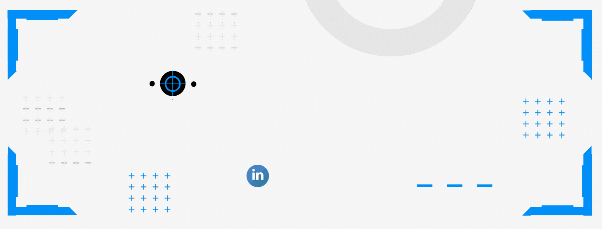

<h1 align="center"> Hola! 👋🏽 Soy Cristian </h1>

 

<h2 align="center">
  Algo acerca de mi
</h2>

Me formé en la carrera de Contador Público Nacional concluyendo la misma en el año 2019.

Tuve mi primer experiencia en el ámbito profesional ese mismo año trabajando en un estudio contable.

Me apasiona la informática y el mundo tecnológico en general, fue por esto que ingresé al Bootcamp de Henry y me convertí en Desarrollador Web Full Stack.

Me gusta enfrentar nuevos desafíos y adquirir nuevos conocimientos en el proceso. Disfruto mucho de colaborar y trabajar en equipo.

"𝐸𝑙 𝑡𝑟𝑎𝑏𝑎𝑗𝑜 𝑒𝑛 𝑒𝑞𝑢𝑖𝑝𝑜 𝑛𝑜𝑠 𝑒𝑛𝑟𝑖𝑞𝑢𝑒𝑐𝑒 𝑐𝑜𝑚𝑜 𝑝𝑟𝑜𝑓𝑒𝑠𝑖𝑜𝑛𝑎𝑙𝑒𝑠, 𝑑𝑎́𝑛𝑑𝑜𝑛𝑜𝑠 𝑝𝑒𝑟𝑠𝑝𝑒𝑐𝑡𝑖𝑣𝑎𝑠 𝑞𝑢𝑒 𝑡𝑎𝑙 𝑣𝑒𝑧 𝑛𝑢𝑛𝑐𝑎 𝘩𝑢𝑏𝑖𝑒́𝑟𝑎𝑚𝑜𝑠 𝑝𝑒𝑛𝑠𝑎𝑑𝑜"

<h2 align="center">
  Manejo de Tecnologías
</h2>

 

 

<h2 align="center">
    Mis contribuciones
</h2>

 

<h2 align="center">
  Donde encontrarme 
</h2>
 

     &nbsp; &nbsp;
     &nbsp; &nbsp;

